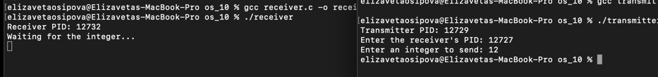
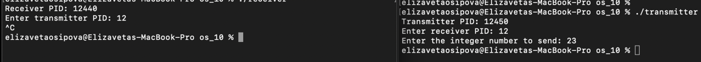

## Домашнее задание №10.

### **Осипова Елизавета Владимировна - БПИ-219**.

Побитовая передача целого числа от одного процесса другому с помощью сигналов SIGUSR1, SIGUSR2. Необходимо написать две программы — передатчик и приемник, которые будут запускаться с разных терминалов. Каждая программа вначале печатает свой.
PID и запрашивает ввод с клавиатуры PID программы–собеседника (вводится пользователем). Порядок ввода PID не имеет значения. Программа—передатчик запрашивает с клавиатуры ввод целого десятичного числа (число может быть и отрицательным!). Введенное число побитово передается программе-приемнику с использованием пользовательских сигналов SIGUSR1 и SIGUSR2. Программа–приемник после завершения приема печатает принятое число в десятичной системе счисления.

```
gcc transmitter.c -o transmitter
gcc receiver.c -o receiver
```





В данном коде реализованы две программы на языке C - передатчик (transmitter) и приемник (receiver), которые обмениваются данными через сигналы SIGUSR1 и SIGUSR2. Процесс обмена данными осуществляется побитово.

Программа-передатчик (transmitter.c):

В функции send_bit() передаем один бит числа, используя сигналы SIGUSR1 и SIGUSR2. Если бит равен 1, отправляем SIGUSR1, если равен 0 - SIGUSR2. Затем вызываем функцию usleep() для задержки, чтобы обеспечить корректную передачу сигналов.

В функции send_integer() передаем каждый бит из 32-битного числа с помощью вызова функции send_bit().

В функции main() выводим PID передатчика и запрашиваем PID приемника. Затем запрашиваем число для передачи и вызываем функцию send_integer() для передачи числа побитово.

Программа-приемник (receiver.c):

В функции receive_bit() принимаем один бит числа на основе полученного сигнала и добавляем его к received_number на соответствующей позиции.

В функциях sigusr1_handler() и sigusr2_handler() вызываем функцию receive_bit() с аргументом, соответствующим полученному сигналу.

В функции setup_signal_handlers() настраиваем обработчики сигналов для SIGUSR1 и SIGUSR2, связывая их с функциями sigusr1_handler() и sigusr2_handler() соответственно.

В функции main() выводим PID приемника и ждем передачи числа. Затем вызываем функцию setup_signal_handlers() для установки обработчиков сигналов. Цикл while ожидает передачи всех 32 бит числа с помощью функции pause(). После получения числа выводим его на экран.

При запуске программ, сначала запустите receiver, чтобы узнать его PID, а затем передайте этот PID в качестве аргумента для программы transmitter. Программа transmitter также попросит вас ввести число для передачи, после чего передаст его побитово с использованием сигналов SIGUSR1 и SIGUSR2. Программа receiver примет число и выведет его на экран.